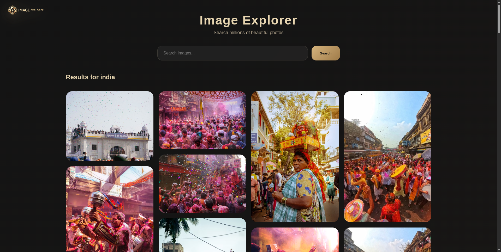

# Image Search

An image search application built with Node.js, Express, EJS, and the Pexels API. Users can search for images and browse high-quality results fetched dynamically from Pexels.

## Features

- Keyword-based image search
- Displays image results in a responsive gallery
- Photographer information
- Direct image download links
- Dynamic server-side rendering using EJS

## Tech Stack

<p>
  
  
  
  
  
</p>

## Project Structure

```text
imageSearch/
├── api
│   └── app.js
├── public
├── views
└── package.json
```

## Running Locally

1. Clone the repository

```bash
git clone <repository-url>
```

2. Install dependencies

```bash
npm install
```

3. Create a `.env` file

```env
APIKEY=your_pexels_api_key
```

4. Start the application

```bash
npm start
```

5. Open

```text
http://localhost:5000
```

## Running Tests

No automated tests are configured for this project.

## Integration Notes

The application can be integrated into larger projects that require image discovery functionality by reusing the Pexels API service layer.

## Visuals

### Search Results



## Live Demo

https://image-search-five-chi.vercel.app/

## Additional Resources

- Pexels API: https://www.pexels.com/api/
